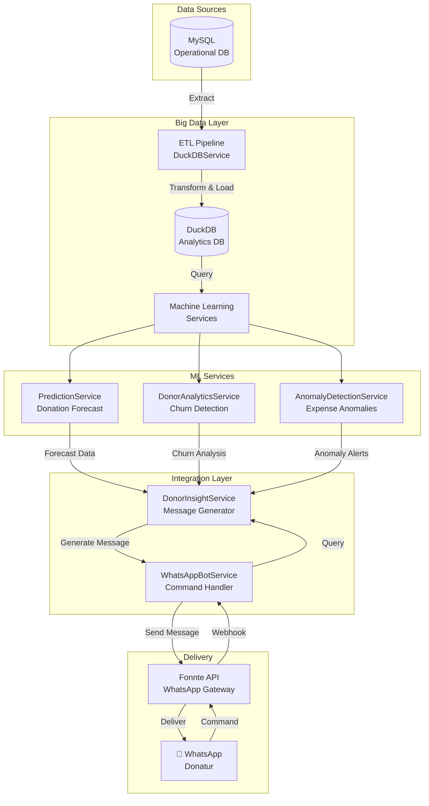

# 🔄 Alur Data: Big Data → WhatsApp Bot

Dokumen ini menjelaskan bagaimana data mengalir dari sistem Big Data Analytics ke WhatsApp Bot untuk memberikan insight personal ke donatur.

---

## 📊 Arsitektur Sistem



---

## 🔄 Alur Data Detail

### 1️⃣ **Data Collection (MySQL)**
```
Tabel Sumber:
├── donasi (transaksi donasi)
├── donatur (data donatur)
├── transaksi_kas (pengeluaran)
└── anak (data anak asuh)
```

**Contoh Data:**
```sql
SELECT * FROM donasi WHERE id_donatur = 1;
-- Output: 
-- id_donasi | id_donatur | jumlah  | tanggal_catat
-- 1         | 1          | 500000  | 2026-01-15
-- 2         | 1          | 500000  | 2025-12-10
```

---

### 2️⃣ **ETL Pipeline (DuckDB)**
**File:** `app/Services/DuckDBService.php`

**Proses:**
```php
// 1. Extract dari MySQL
$donations = DB::table('donasi')->get();

// 2. Transform (agregasi, kalkulasi)
$aggregated = $donations->groupBy('id_donatur')
    ->map(function($items) {
        return [
            'total' => $items->sum('jumlah'),
            'count' => $items->count(),
            'avg' => $items->avg('jumlah')
        ];
    });

// 3. Load ke DuckDB
$duckdb->execute("INSERT INTO donor_stats ...");
```

**Hasil di DuckDB:**
```
donor_id | total_donation | donation_count | avg_donation | last_donation_date
1        | 6000000        | 12             | 500000       | 2026-01-15
```

---

### 3️⃣ **Machine Learning Analysis**

#### A. **Donation Prediction** (`PredictionService`)
```php
// Input: Historical data 6 bulan
$donations = [
    ['month' => 'Aug', 'total' => 4500000],
    ['month' => 'Sep', 'total' => 5000000],
    ['month' => 'Oct', 'total' => 5200000],
    ['month' => 'Nov', 'total' => 5500000],
    ['month' => 'Dec', 'total' => 5800000],
    ['month' => 'Jan', 'total' => 6000000]
];

// Algoritma: Linear Regression
$prediction = $this->linearRegression($x, $y);

// Output:
[
    'predicted_amount' => 6200000,
    'confidence' => 87.5
]
```

#### B. **Churn Detection** (`DonorAnalyticsService`)
```php
// Input: Donor data
$donor = [
    'id' => 1,
    'days_since_last' => 95,  // 95 hari tidak donasi
    'total_donations' => 12,
    'recent_count' => 0       // 0 donasi 3 bulan terakhir
];

// Scoring:
$score = 0;
$score += ($days_since_last > 90) ? 40 : 0;  // +40
$score += ($recent_count == 0) ? 30 : 0;     // +30
// Total: 70 (MEDIUM RISK)

// Output:
[
    'donor_id' => 1,
    'name' => 'Pak Budi',
    'risk_score' => 70,
    'risk_level' => 'MEDIUM'
]
```

#### C. **Anomaly Detection** (`AnomalyDetectionService`)
```php
// Input: Expense data per kategori
$expenses = [
    'Konsumsi' => [3000000, 3200000, 3100000, 5500000] // Bulan terakhir anomali
];

// Kalkulasi Z-Score:
$mean = 3100000;
$stdDev = 100000;
$zScore = (5500000 - 3100000) / 100000 = 24; // > 2 = ANOMALI!

// Output:
[
    'category' => 'Konsumsi',
    'amount' => 5500000,
    'type' => 'OVERSPENDING',
    'severity' => 'HIGH'
]
```

---

### 4️⃣ **Message Generation** (`DonorInsightService`)

**Proses:**
```php
public function generatePersonalizedMessage($donorId)
{
    // 1. Get donor stats
    $ltv = $this->analytics->getDonorLifetimeValue($donorId);
    // Output: ['total_value' => 6000000, 'total_donations' => 12]
    
    // 2. Calculate impact
    $impact = $this->calculateImpact($ltv['total_value']);
    // Output: ['meals' => 400, 'education' => 60, 'health' => 120]
    
    // 3. Generate message
    $message = "🙏 Terima kasih *Pak Budi*!\n\n";
    $message .= "💰 Total Donasi: Rp 6.000.000\n";
    $message .= "📊 Frekuensi: 12 kali\n\n";
    $message .= "✨ *Dampak Donasi Anda:*\n";
    $message .= "🍚 Membantu 400 porsi makan anak\n";
    $message .= "📚 Mendukung 60 anak sekolah\n";
    $message .= "🏥 Biaya kesehatan 120 anak\n\n";
    $message .= "Semoga berkah! 🤲✨";
    
    return $message;
}
```

---

### 5️⃣ **WhatsApp Bot Integration** (`WhatsAppBotService`)

**Flow Diagram:**
```
Donatur kirim "INFO" via WA
        ↓
Fonnte webhook → /webhook/whatsapp
        ↓
WhatsAppBotService::processMessage()
        ↓
Check: Apakah donor terdaftar?
        ↓ (YES)
getDonorByWhatsApp($from)
        ↓
DonorInsightService::getDonorInfo($donorId)
        ↓
Query ML Services:
  - PredictionService (forecast)
  - DonorAnalyticsService (LTV)
  - AnomalyDetectionService (alerts)
        ↓
Generate personalized message
        ↓
WhatsAppNotificationService::send()
        ↓
Fonnte API → WhatsApp Donatur
```

**Code Example:**
```php
// WhatsAppBotService.php
public function processMessage($from, $body)
{
    $donor = $this->getDonorByWhatsApp($from);
    
    if ($donor && str_contains($body, 'info')) {
        // Ambil data dari Big Data
        $message = $this->insightService->getDonorInfo($donor->id_donatur);
        
        // Kirim via WhatsApp
        return $message;
    }
}
```

---

## 📱 Contoh Interaksi Real

### **Skenario 1: Donor Cek Info**
```
Donatur: INFO
Bot: 📊 *INFO DONASI ANDA*

💰 Total Donasi: Rp 6.000.000
📅 Frekuensi: 12 kali
📈 Rata-rata: Rp 500.000
⏱️ Aktif: 12 bulan
```

**Data Flow:**
1. WhatsApp → Fonnte → Laravel
2. Laravel query `donatur_whatsapp` → get `id_donatur`
3. `DonorAnalyticsService::getDonorLifetimeValue(id_donatur)`
4. DuckDB query aggregated data
5. Format message → Send via Fonnte

---

### **Skenario 2: Donor Cek Dampak**
```
Donatur: DAMPAK
Bot: 🙏 Terima kasih *Pak Budi*!

💰 Donasi Bulan Ini: Rp 500.000
📊 Total Tahun Ini: Rp 6.000.000

✨ *Dampak Donasi Anda:*
🍚 Membantu 400 porsi makan anak
📚 Mendukung 60 anak sekolah
🏥 Biaya kesehatan 120 anak

Semoga berkah! 🤲✨
```

**Data Flow:**
1. WhatsApp → Fonnte → Laravel
2. `DonorInsightService::generatePersonalizedMessage(id_donatur)`
3. Query MySQL: `SELECT SUM(jumlah) FROM donasi WHERE ...`
4. Calculate impact: `meals = total / 15000`
5. Format message → Send via Fonnte

---

### **Skenario 3: Donor Cek Prediksi**
```
Donatur: SALDO
Bot: 📊 *PREDIKSI KEBUTUHAN DANA*

📅 *Feb 2026*
Prediksi Masuk: Rp 6.200.000
Prediksi Keluar: Rp 5.500.000
Saldo Akhir: Rp 700.000

📅 *Mar 2026*
Prediksi Masuk: Rp 6.400.000
Prediksi Keluar: Rp 5.500.000
Saldo Akhir: Rp 1.600.000
```

**Data Flow:**
1. WhatsApp → Fonnte → Laravel
2. `PredictionService::forecastCashFlow()`
3. DuckDB query historical data
4. ML: Linear regression prediction
5. Format table → Send via Fonnte

---

## 🔄 Automated Monthly Reports

**Trigger:** Laravel Scheduler (tanggal 1, jam 08:00)

**Process:**
```php
// SendMonthlyReports.php
public function handle()
{
    // 1. Generate report dari Big Data
    $report = $this->insightService->generateMonthlyReport();
    
    // 2. Get all active donors
    $donors = DB::table('donatur_whatsapp')
        ->where('is_verified', true)
        ->get();
    
    // 3. Send to each donor
    foreach ($donors as $donor) {
        $message = "Halo *{$donor->nama}*! 🙏\n\n" . $report;
        $this->waService->send($donor->whatsapp_number, $message);
        sleep(1); // Rate limiting
    }
}
```

**Report Content:**
```
📊 *LAPORAN BULANAN*
_Januari 2026_

━━━━━━━━━━━━━━━━━━━━

💰 *Dana Masuk:* Rp 6.000.000
📤 *Dana Keluar:* Rp 5.500.000

📋 *Rincian Pengeluaran:*
• Konsumsi: Rp 3.000.000
• Pendidikan: Rp 1.500.000
• Kesehatan: Rp 1.000.000

👶 *Jumlah Anak Asuh:* 25 anak

━━━━━━━━━━━━━━━━━━━━

Terima kasih atas dukungan Anda! 🙏
_Panti Asuhan Assholihin_
```

---

## 🎯 Key Benefits

### Untuk Donatur:
✅ **Personalized Insights** - Setiap donatur dapat info spesifik mereka  
✅ **Real-time Updates** - Data selalu update dari Big Data  
✅ **Easy Access** - Cukup kirim command via WhatsApp  
✅ **Transparency** - Lihat dampak nyata dari donasi

### Untuk Admin:
✅ **Automated Reporting** - Laporan bulanan otomatis ke semua donatur  
✅ **Churn Prevention** - Deteksi donor berisiko berhenti  
✅ **Anomaly Alerts** - Deteksi pengeluaran tidak normal  
✅ **Data-Driven Decisions** - Prediksi untuk planning

---

## 🔧 Technical Stack

| Layer | Technology |
|-------|------------|
| Data Source | MySQL |
| Analytics DB | DuckDB |
| ML Engine | Custom PHP (Linear Regression, Z-Score) |
| Message Queue | Laravel Queue (optional) |
| WhatsApp Gateway | Fonnte API |
| Scheduler | Laravel Scheduler (Cron) |

---

## 📈 Performance Metrics

- **ETL Runtime:** ~2-5 detik (untuk 1000 records)
- **ML Prediction:** ~100ms per prediction
- **Message Generation:** ~50ms per message
- **WhatsApp Delivery:** ~1-2 detik per message
- **Batch Report:** ~2 menit untuk 100 donatur

---

**Kesimpulan:** Sistem ini mengintegrasikan Big Data Analytics dengan WhatsApp Bot untuk memberikan pengalaman personal dan real-time kepada donatur, sekaligus membantu admin dalam pengambilan keputusan berbasis data. 🚀
