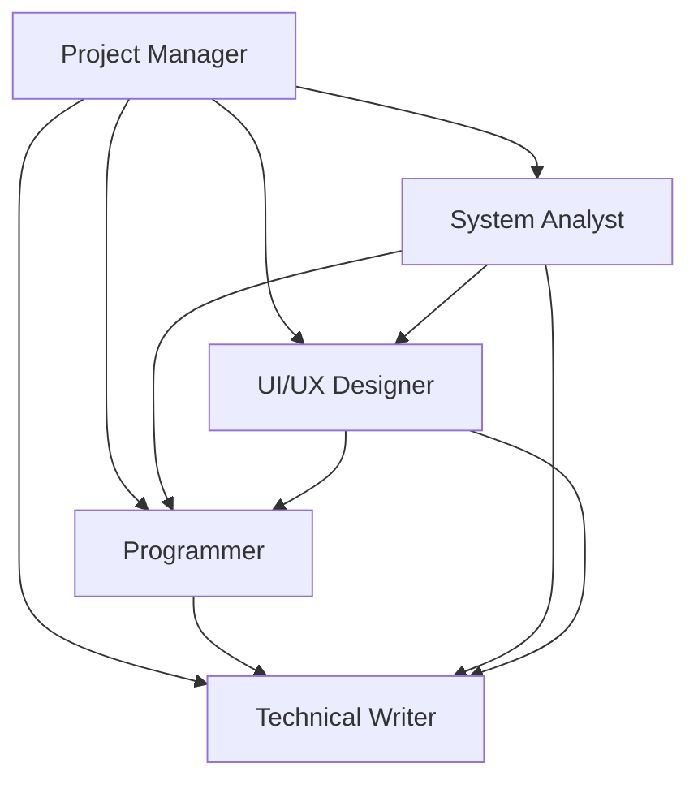

# TIM PROJECT - SISTEM INFORMASI PANTI ASUHAN ASSHOLIHIN

## STRUKTUR TIM

Tim project terdiri dari **5 orang** dengan pembagian peran sebagai berikut:

---

## 1. PROJECT MANAGER (PM)

### 👤 Peran & Tanggung Jawab:

**Definisi:**  
Project Manager adalah pemimpin tim yang bertanggung jawab atas keseluruhan project dari awal hingga selesai.

**Tugas Utama:**
- 📋 **Perencanaan Project**
  - Membuat timeline dan milestone project
  - Menentukan scope dan deliverables
  - Menyusun Work Breakdown Structure (WBS)
  
- 👥 **Manajemen Tim**
  - Koordinasi antar anggota tim
  - Distribusi tugas sesuai keahlian
  - Monitoring progress setiap anggota
  
- 📊 **Monitoring & Controlling**
  - Track progress vs timeline
  - Identifikasi dan mitigasi risiko
  - Ensure quality standards
  
- 💬 **Komunikasi Stakeholder**
  - Presentasi progress ke dosen pembimbing
  - Koordinasi dengan pihak panti asuhan
  - Laporan berkala ke stakeholder

**Deliverables:**
- Project charter
- Timeline & Gantt chart
- Risk management plan
- Progress reports
- Final presentation

**Tools yang Digunakan:**
- Trello/Jira untuk task management
- Google Sheets untuk timeline
- Microsoft Project (optional)

---

## 2. SYSTEM ANALYST (SA)

### 🔍 Peran & Tanggung Jawab:

**Definisi:**  
System Analyst adalah jembatan antara kebutuhan user dan solusi teknis.

**Tugas Utama:**
- 📝 **Requirement Gathering**
  - Wawancara dengan pihak panti asuhan
  - Identifikasi kebutuhan fungsional & non-fungsional
  - Dokumentasi user requirements
  
- 🎯 **Analisis Sistem**
  - Analisis sistem yang sedang berjalan (manual)
  - Gap analysis
  - Feasibility study (teknis, ekonomi, operasional)
  
- 📐 **Desain Sistem**
  - Membuat Use Case Diagram
  - Membuat Activity Diagram
  - Membuat Sequence Diagram
  - Membuat Data Flow Diagram (DFD)
  
- 🗄️ **Database Design**
  - Membuat Entity Relationship Diagram (ERD)
  - Normalisasi database
  - Definisi tabel dan relasi

**Deliverables:**
- Software Requirement Specification (SRS)
- Use Case Document
- ERD Database (20 tabel)
- DFD Level 0, 1, 2
- System Design Document

**Tools yang Digunakan:**
- Draw.io / Lucidchart untuk diagram
- Microsoft Visio
- Mermaid untuk ERD
- MySQL Workbench untuk database design

**Untuk Project Ini:**
- ✅ Telah membuat ERD dengan 20 tabel
- ✅ Telah membuat Use Case Diagram
- ✅ Telah membuat 14 Sequence Diagram
- ✅ Telah membuat DFD Level 1

---

## 3. UI/UX DESIGNER

### 🎨 Peran & Tanggung Jawab:

**Definisi:**  
UI/UX Designer bertanggung jawab atas tampilan dan pengalaman pengguna sistem.

**Tugas Utama:**
- 🧑‍💻 **User Research**
  - Memahami user persona (admin, pengurus)
  - Analisis user journey
  - Identifikasi pain points
  
- 🖼️ **UI Design**
  - Membuat wireframe
  - Membuat mockup high-fidelity
  - Desain color scheme & typography
  - Icon & asset design
  
- 🎯 **UX Design**
  - Information architecture
  - User flow diagram
  - Interaction design
  - Usability testing
  
- 📱 **Responsive Design**
  - Desktop layout
  - Tablet layout
  - Mobile layout

**Deliverables:**
- User persona document
- Wireframes (low-fidelity)
- Mockups (high-fidelity)
- Style guide & design system
- Prototype (clickable)
- Usability test report

**Tools yang Digunakan:**
- Figma / Adobe XD untuk design
- Canva untuk asset
- Google Fonts untuk typography
- Coolors.co untuk color palette

**Untuk Project Ini:**
- ✅ Design menggunakan Bootstrap 5
- ✅ Color scheme: Hijau (#0D7C66) sebagai primary
- ✅ Responsive layout
- ✅ Clean & professional interface
- ✅ Icon menggunakan Font Awesome

---

## 4. PROGRAMMER

### 💻 Peran & Tanggung Jawab:

**Definisi:**  
Programmer adalah developer yang mengimplementasikan desain sistem menjadi aplikasi yang berfungsi.

**Tugas Utama:**
- ⚙️ **Backend Development**
  - Implementasi database (migrations)
  - Membuat Models (Eloquent ORM)
  - Membuat Controllers (business logic)
  - Membuat API endpoints (jika diperlukan)
  
- 🌐 **Frontend Development**
  - Implementasi UI design ke Blade templates
  - JavaScript untuk interactivity
  - AJAX untuk dynamic content
  - Form validation
  
- 🔧 **Integration**
  - Integrasi frontend-backend
  - Third-party library integration
  - Payment gateway (jika ada)
  - Export functionality (Excel, PDF)
  
- 🧪 **Testing**
  - Unit testing
  - Integration testing
  - Bug fixing
  - Performance optimization

**Deliverables:**
- Source code (clean & documented)
- Database migrations
- Controllers (17 files)
- Models (12 files)
- Views (Blade templates)
- Export classes (Excel & PDF)
- Test cases

**Tools & Technologies:**
- **Backend:** Laravel 11, PHP 8.2+
- **Database:** MySQL 8.0+
- **Frontend:** Blade, Bootstrap 5, jQuery
- **Libraries:** Maatwebsite Excel, DomPDF
- **Version Control:** Git & GitHub
- **IDE:** VS Code / PhpStorm

**Untuk Project Ini:**
- ✅ 67 routes implemented
- ✅ 17 controllers
- ✅ 12 models dengan relationships
- ✅ 20 tabel database
- ✅ Export Excel & PDF dengan styling
- ✅ CRUD lengkap untuk semua modul
- ✅ Dashboard dengan charts

---

## 5. TECHNICAL WRITER / PENYUSUN DOKUMEN

### 📚 Peran & Tanggung Jawab:

**Definisi:**  
Technical Writer bertanggung jawab atas semua dokumentasi project.

**Tugas Utama:**
- 📖 **Dokumentasi Teknis**
  - System documentation
  - API documentation (jika ada)
  - Database schema documentation
  - Code documentation (comments)
  
- 📘 **User Documentation**
  - User manual / panduan pengguna
  - Admin guide
  - FAQ document
  - Tutorial videos script
  
- 📝 **Project Documentation**
  - Laporan capstone project
  - Proposal project
  - Progress reports
  - Final report
  
- 🎓 **Academic Documentation**
  - Abstrak
  - Bab 1-5 (Pendahuluan, Tinjauan Pustaka, Metodologi, Hasil, Kesimpulan)
  - Daftar pustaka
  - Lampiran

**Deliverables:**
- Proposal Project
- Laporan Capstone (Bab 1-5)
- User Manual
- Technical Documentation
- System Design Document
- API Documentation
- Presentation slides
- Video demo script

**Tools yang Digunakan:**
- Microsoft Word untuk laporan formal
- Markdown untuk dokumentasi teknis
- Google Docs untuk kolaborasi
- Canva untuk infografis
- PowerPoint untuk presentasi

**Untuk Project Ini:**
- ✅ Bug Analysis Report
- ✅ System Design Report
- ✅ Capstone Answers (kunci jawaban ujian)
- ✅ Mermaid Diagrams (10 diagram)
- ✅ Formal Report Template
- ✅ Implementation Plan
- ✅ Walkthrough Documentation

---

## KOLABORASI TIM

### Workflow Project:

```
1. PM → Kick-off meeting, buat timeline
2. SA → Requirement gathering, buat ERD & diagram
3. UI/UX → Design mockup berdasarkan requirements
4. Programmer → Implementasi berdasarkan design & ERD
5. Technical Writer → Dokumentasi setiap fase
6. PM → Review & quality control
```

### Communication Flow:



### Tools Kolaborasi:
- **Communication:** WhatsApp Group, Discord
- **Task Management:** Trello / Notion
- **Version Control:** GitHub
- **Documentation:** Google Drive
- **Meeting:** Google Meet / Zoom

---

## PEMBAGIAN WAKTU (TIMELINE)

| Fase | Durasi | PIC Utama | Deliverables |
|------|--------|-----------|--------------|
| **Planning** | Week 1-2 | PM, SA | Project charter, SRS, ERD |
| **Design** | Week 3-4 | SA, UI/UX | Mockups, diagrams |
| **Development** | Week 5-10 | Programmer | Working system |
| **Testing** | Week 11-12 | All team | Test reports, bug fixes |
| **Documentation** | Week 1-12 | Technical Writer | All documents |
| **Presentation** | Week 13 | PM, All team | Final presentation |

---

## KRITERIA SUKSES TIM

### Project Manager:
- ✅ Project selesai tepat waktu
- ✅ Semua deliverables terpenuhi
- ✅ Tim bekerja efektif

### System Analyst:
- ✅ Requirements lengkap & akurat
- ✅ Diagram jelas & sesuai standar
- ✅ Database design optimal

### UI/UX Designer:
- ✅ Interface user-friendly
- ✅ Design konsisten
- ✅ Usability test passed

### Programmer:
- ✅ Code clean & maintainable
- ✅ Semua fitur berfungsi
- ✅ No critical bugs

### Technical Writer:
- ✅ Dokumentasi lengkap
- ✅ Laporan sesuai format akademis
- ✅ User manual jelas

---

## KESIMPULAN

Setiap role memiliki tanggung jawab spesifik namun saling berkolaborasi untuk kesuksesan project. Komunikasi yang baik dan koordinasi yang solid adalah kunci keberhasilan tim.

**"Teamwork makes the dream work!"** 🚀

---

**Dokumen ini disusun untuk keperluan Capstone Project**  
**Sistem Informasi Panti Asuhan Assholihin**  
**© 2026**
