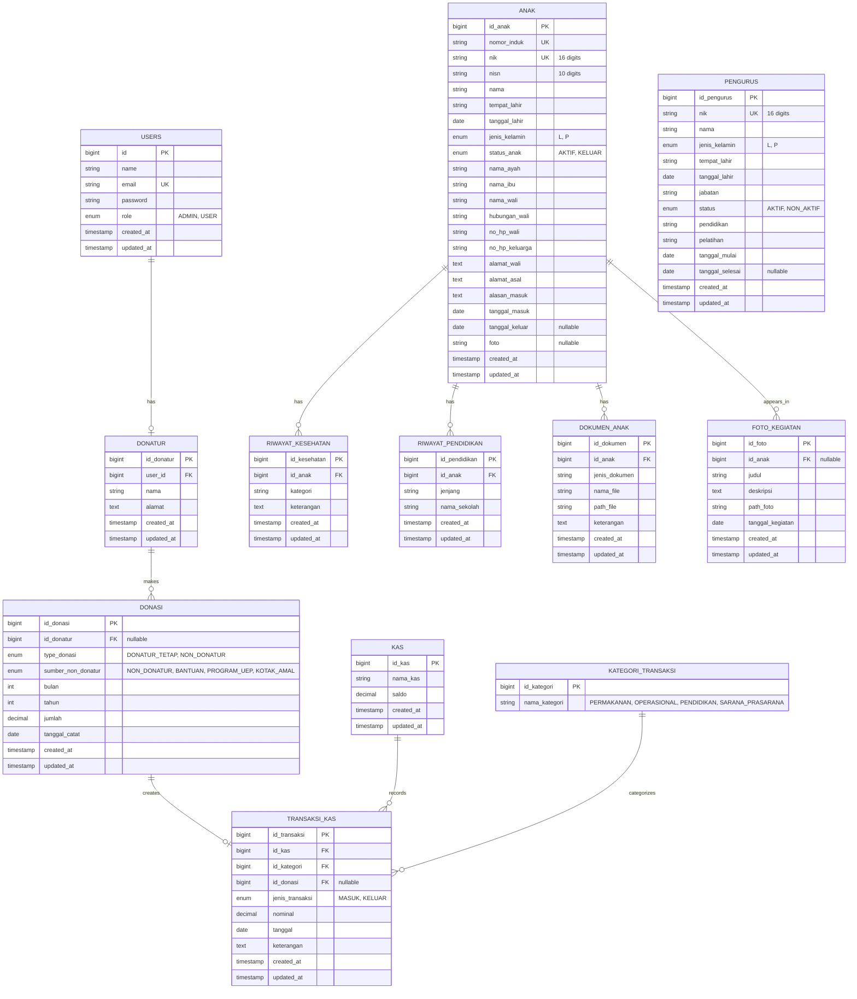

# MERMAID DIAGRAMS - SISTEM INFORMASI PANTI ASUHAN ASSHOLIHIN

## 1. ENTITY RELATIONSHIP DIAGRAM (ERD)

### ERD Lengkap - 20 Tabel



---

## 2. SYSTEM ARCHITECTURE DIAGRAM

### Arsitektur 5 Layer

```mermaid
graph TB
    subgraph CLIENT["CLIENT LAYER"]
        Browser["🌐 Web Browser<br/>Chrome, Firefox, Edge"]
        Mobile["📱 Mobile Browser"]
        Tablet["📱 Tablet Browser"]
    end

    subgraph PRESENTATION["PRESENTATION LAYER"]
        Blade["📄 Blade Templates<br/>• layouts/app.blade.php<br/>• auth/login.blade.php<br/>• dashboard/index.blade.php<br/>• anak/*, pengurus/*, etc"]
        Assets["🎨 Assets<br/>• Bootstrap 5<br/>• Font Awesome<br/>• Chart.js"]
    end

    subgraph APPLICATION["APPLICATION LAYER"]
        Routes["🛣️ Routes<br/>67 Routes"]
        Middleware["🔒 Middleware<br/>• Authentication<br/>• CSRF Protection<br/>• Role-based Access"]
        Controllers["🎮 Controllers<br/>• AnakController<br/>• DashboardController<br/>• DonasiController<br/>• TransaksiKasController<br/>• LaporanController<br/>• PengurusController<br/>• GalleryController"]
    end

    subgraph BUSINESS["BUSINESS LOGIC LAYER"]
        Models["📦 Models (Eloquent ORM)<br/>• Anak<br/>• Pengurus<br/>• Donasi<br/>• TransaksiKas<br/>• RiwayatKesehatan<br/>• RiwayatPendidikan<br/>• DokumenAnak<br/>• FotoKegiatan"]
        Exports["📊 Export Services<br/>• LaporanKeuanganExport<br/>• RekapTahunanExport<br/>• AnakExport<br/>• PDF Generation"]
    end

    subgraph DATA["DATA LAYER"]
        Database["🗄️ MySQL Database 8.0+<br/>20 Tables"]
        Storage["💾 File Storage<br/>• storage/app/public/anak<br/>• storage/app/public/dokumen<br/>• storage/app/public/gallery"]
    end

    Browser --> Blade
    Mobile --> Blade
    Tablet --> Blade
    
    Blade --> Routes
    Assets --> Blade
    
    Routes --> Middleware
    Middleware --> Controllers
    
    Controllers --> Models
    Controllers --> Exports
    
    Models --> Database
    Exports --> Database
    Exports --> Storage
    Models --> Storage

    style CLIENT fill:#E3F2FD,stroke:#1976D2,stroke-width:2px
    style PRESENTATION fill:#F3E5F5,stroke:#7B1FA2,stroke-width:2px
    style APPLICATION fill:#E8F5E9,stroke:#388E3C,stroke-width:2px
    style BUSINESS fill:#FFF3E0,stroke:#F57C00,stroke-width:2px
    style DATA fill:#FCE4EC,stroke:#C2185B,stroke-width:2px
```



---

## 3. USE CASE DIAGRAM

```mermaid
graph LR
    Admin((👤 Admin))
    Pengurus((👤 Pengurus))
    
    subgraph SISTEM["SISTEM INFORMASI PANTI ASUHAN"]
        UC1[Kelola Data Anak Asuh]
        UC2[Kelola Data Pengurus]
        UC3[Kelola Keuangan]
        UC4[Kelola Gallery]
        UC5[Lihat Dashboard]
        UC6[Generate Laporan]
        UC7[Lihat Data Anak]
        UC8[Lihat Laporan]
    end
    
    Admin --> UC1
    Admin --> UC2
    Admin --> UC3
    Admin --> UC4
    Admin --> UC5
    Admin --> UC6
    
    Pengurus --> UC7
    Pengurus --> UC5
    Pengurus --> UC8
    
    UC1 -.->|include| UC1A[Upload Dokumen]
    UC1 -.->|include| UC1B[Upload Foto]
    UC1 -.->|include| UC1C[Kelola Riwayat]
    
    UC3 -.->|include| UC3A[Catat Donasi]
    UC3 -.->|include| UC3B[Catat Pengeluaran]
    
    UC6 -.->|include| UC6A[Export Excel]
    UC6 -.->|include| UC6B[Export PDF]

    style Admin fill:#4CAF50,stroke:#2E7D32,stroke-width:3px,color:#fff
    style Pengurus fill:#2196F3,stroke:#1565C0,stroke-width:3px,color:#fff
    style SISTEM fill:#F5F5F5,stroke:#9E9E9E,stroke-width:2px
```



---

## 4. SEQUENCE DIAGRAMS - SEMUA FITUR

### 4.1 Sequence: Login Process


---

### 4.2 Sequence: Tambah Data Anak Asuh


---

### 4.3 Sequence: Edit Data Anak Asuh


---

### 4.4 Sequence: Hapus Data Anak Asuh


---

### 4.5 Sequence: Tambah Riwayat Kesehatan


---

### 4.6 Sequence: Catat Donasi


---

### 4.7 Sequence: Catat Pengeluaran


---

### 4.8 Sequence: Generate Laporan Excel


---

### 4.9 Sequence: Generate Laporan PDF


---

### 4.10 Sequence: Upload Dokumen Anak


---

### 4.11 Sequence: Upload Foto Kegiatan (Gallery)


---

### 4.12 Sequence: Lihat Dashboard


---

### 4.13 Sequence: Kelola Data Pengurus


---

### 4.14 Sequence: Export Data Anak (Excel)


---


---

## 7. FLOWCHART - GENERATE LAPORAN


---

## 8. DATA FLOW DIAGRAM (DFD) - LEVEL 1

```mermaid
graph TB
    Admin((👤 Admin))
    
    subgraph DFD["DATA FLOW DIAGRAM - LEVEL 1"]
        P1[1.0<br/>Kelola Data Anak]
        P2[2.0<br/>Kelola Riwayat]
        P3[3.0<br/>Kelola Keuangan]
        P4[4.0<br/>Generate Laporan]
        
        D1[(D1: ANAK)]
        D2[(D2: RIWAYAT)]
        D3[(D3: DONASI)]
        D4[(D4: TRANSAKSI)]
    end
    
    Admin -->|Data Anak| P1
    P1 -->|Simpan| D1
    D1 -->|Read| P1
    P1 -->|Data Anak| Admin
    
    Admin -->|Data Riwayat| P2
    P2 -->|Simpan| D2
    D2 -->|Read| P2
    
    Admin -->|Data Donasi/Pengeluaran| P3
    P3 -->|Simpan Donasi| D3
    P3 -->|Simpan Transaksi| D4
    D3 -->|Read| P3
    D4 -->|Read| P3
    
    Admin -->|Request Laporan| P4
    D3 -->|Data Donasi| P4
    D4 -->|Data Transaksi| P4
    P4 -->|Laporan Excel/PDF| Admin

    style Admin fill:#4CAF50,stroke:#2E7D32,stroke-width:3px,color:#fff
    style P1 fill:#2196F3,stroke:#1565C0,stroke-width:2px,color:#fff
    style P2 fill:#2196F3,stroke:#1565C0,stroke-width:2px,color:#fff
    style P3 fill:#2196F3,stroke:#1565C0,stroke-width:2px,color:#fff
    style P4 fill:#2196F3,stroke:#1565C0,stroke-width:2px,color:#fff
    style D1 fill:#FF9800,stroke:#E65100,stroke-width:2px
    style D2 fill:#FF9800,stroke:#E65100,stroke-width:2px
    style D3 fill:#FF9800,stroke:#E65100,stroke-width:2px
    style D4 fill:#FF9800,stroke:#E65100,stroke-width:2px
```



---

## 9. STATE DIAGRAM - STATUS ANAK

```mermaid
stateDiagram-v2
    [*] --> Pendaftaran: Anak masuk panti
    
    Pendaftaran --> Aktif: Data lengkap & disetujui
    
    Aktif --> Aktif: Update data
    Aktif --> Keluar: Anak keluar dari panti
    
    Keluar --> [*]: Arsip data
    
    note right of Aktif
        Status: AKTIF
        - Mendapat fasilitas panti
        - Data dapat diupdate
        - Riwayat tercatat
    end note
    
    note right of Keluar
        Status: KELUAR
        - Data diarsip
        - Tanggal keluar tercatat
        - Riwayat tetap tersimpan
    end note
```

---

## 10. COMPONENT DIAGRAM - EXPORT SYSTEM

```mermaid
graph TB
    subgraph EXPORT["EXPORT SYSTEM"]
        Controller[LaporanController]
        
        subgraph Excel["Excel Export"]
            ExcelExport[LaporanKeuanganExport]
            RekapExport[RekapTahunanExport]
            AnakExport[AnakExport]
        end
        
        subgraph PDF["PDF Export"]
            PDFView[laporan/pdf.blade.php]
            DomPDF[DomPDF Library]
        end
        
        subgraph Styling["Styling Components"]
            PhpSpreadsheet[PhpSpreadsheet<br/>• Colors<br/>• Borders<br/>• Fonts<br/>• Number Format]
            CSS[CSS Styling<br/>• Layout<br/>• Colors<br/>• Typography]
        end
    end
    
    Controller --> ExcelExport
    Controller --> RekapExport
    Controller --> AnakExport
    Controller --> PDFView
    
    ExcelExport --> PhpSpreadsheet
    RekapExport --> PhpSpreadsheet
    AnakExport --> PhpSpreadsheet
    
    PDFView --> CSS
    PDFView --> DomPDF
    
    PhpSpreadsheet --> Output1[Excel File<br/>.xlsx]
    DomPDF --> Output2[PDF File<br/>.pdf]

    style Controller fill:#4CAF50,stroke:#2E7D32,stroke-width:2px,color:#fff
    style Excel fill:#2196F3,stroke:#1565C0,stroke-width:2px
    style PDF fill:#FF9800,stroke:#E65100,stroke-width:2px
    style Styling fill:#9C27B0,stroke:#6A1B9A,stroke-width:2px
    style Output1 fill:#00BCD4,stroke:#0097A7,stroke-width:2px
    style Output2 fill:#F44336,stroke:#C62828,stroke-width:2px,color:#fff
```

---

## CARA MENGGUNAKAN DIAGRAM MERMAID

### 1. Di GitHub/GitLab
File ini sudah siap! Cukup push ke repository dan diagram akan otomatis ter-render.

### 2. Di Mermaid Live Editor
- Buka: https://mermaid.live/
- Copy salah satu code block mermaid
- Paste di editor
- Export sebagai PNG/SVG/PDF

### 3. Di VS Code
- Install extension: **"Markdown Preview Mermaid Support"**
- Buka file `erd.md`
- Tekan `Ctrl+Shift+V` untuk preview
- Semua diagram akan ter-render

### 4. Di Notion
- Buat block "/code"
- Pilih language "Mermaid"
- Paste code mermaid
- Diagram otomatis render

### 5. Export untuk Laporan
- Gunakan Mermaid Live Editor
- Export sebagai PNG (high resolution)
- Insert ke Word/PowerPoint

---

**Semua diagram siap digunakan untuk laporan capstone project!** 🎓