# ERD & UML Diagrams - CAPS3 Project
## Sistem Informasi Panti Asuhan Assholihin

---

## 1. Entity Relationship Diagram (ERD)

Diagram ini menunjukkan struktur database dan relasi antar tabel dalam sistem.

---

## 2. UML Class Diagram

Diagram ini menunjukkan struktur class model dan method-method yang tersedia.

---

## 3. Database Summary

### Core Modules

| Module | Tables | Description |
|--------|--------|-------------|
| **User Management** | users, activity_log | Authentication, authorization, and audit trail |
| **Children Management** | anak, riwayat_kesehatan, riwayat_pendidikan, dokumen_anak, foto_kegiatan, growth_monitoring | Complete child records with health, education, documents, and growth tracking |
| **Donation Management** | donatur, donasi | Donor profiles and donation records |
| **Financial Management** | kas, kategori_transaksi, transaksi_kas | Cash management with categorized transactions |
| **Staff Management** | pengurus | Staff information and HR records |

### Key Relationships

- **One-to-Many (hasMany)**:
  - Anak → RiwayatKesehatan, RiwayatPendidikan, DokumenAnak, FotoKegiatan, GrowthMonitoring
  - Donatur → Donasi
  - Kas → TransaksiKas
  - KategoriTransaksi → TransaksiKas
  - User → ActivityLog

- **Many-to-One (belongsTo)**:
  - Donatur → User
  - Donasi → Donatur
  - TransaksiKas → Kas, KategoriTransaksi, Donasi
  - All child records → Anak

- **One-to-One**:
  - Donasi → TransaksiKas (each donation creates one transaction)
  - User → Donatur (each donor has one user account)

### Special Features

- **AI/ML Integration**: GrowthMonitoring has `rekomendasi_ai` field for AI-powered nutrition recommendations
- **Audit Trail**: ActivityLog tracks all important actions with old/new values
- **Flexible Donation**: Supports both registered donors (DONATUR_TETAP) and anonymous donations (NON_DONATUR)
- **Growth Monitoring**: WHO Z-score based stunting detection and monitoring

---

## 4. SYSTEM ARCHITECTURE DIAGRAM

### Arsitektur 5 Layer

```mermaid
graph TB
    subgraph CLIENT["CLIENT LAYER"]
        Browser["🌐 Web Browser<br/>Chrome, Firefox, Edge"]
        Mobile["📱 Mobile Browser"]
        Tablet["📱 Tablet Browser"]
    end

    subgraph PRESENTATION["PRESENTATION LAYER"]
        Blade["📄 Blade Templates<br/>• layouts/app.blade.php<br/>• auth/login.blade.php<br/>• dashboard/index.blade.php<br/>• anak/*, pengurus/*, etc"]
        Assets["🎨 Assets<br/>• Bootstrap 5<br/>• Font Awesome<br/>• Chart.js"]
    end

    subgraph APPLICATION["APPLICATION LAYER"]
        Routes["🛣️ Routes<br/>67 Routes"]
        Middleware["🔒 Middleware<br/>• Authentication<br/>• CSRF Protection<br/>• Role-based Access"]
        Controllers["🎮 Controllers<br/>• AnakController<br/>• DashboardController<br/>• DonasiController<br/>• TransaksiKasController<br/>• LaporanController<br/>• PengurusController<br/>• GalleryController"]
    end

    subgraph BUSINESS["BUSINESS LOGIC LAYER"]
        Models["📦 Models (Eloquent ORM)<br/>• Anak<br/>• Pengurus<br/>• Donasi<br/>• TransaksiKas<br/>• RiwayatKesehatan<br/>• RiwayatPendidikan<br/>• DokumenAnak<br/>• FotoKegiatan"]
        Exports["📊 Export Services<br/>• LaporanKeuanganExport<br/>• RekapTahunanExport<br/>• AnakExport<br/>• PDF Generation"]
    end

    subgraph DATA["DATA LAYER"]
        Database["🗄️ MySQL Database 8.0+<br/>20 Tables"]
        Storage["💾 File Storage<br/>• storage/app/public/anak<br/>• storage/app/public/dokumen<br/>• storage/app/public/gallery"]
    end

    Browser --> Blade
    Mobile --> Blade
    Tablet --> Blade
    
    Blade --> Routes
    Assets --> Blade
    
    Routes --> Middleware
    Middleware --> Controllers
    
    Controllers --> Models
    Controllers --> Exports
    
    Models --> Database
    Exports --> Database
    Exports --> Storage
    Models --> Storage

    style CLIENT fill:#E3F2FD,stroke:#1976D2,stroke-width:2px
    style PRESENTATION fill:#F3E5F5,stroke:#7B1FA2,stroke-width:2px
    style APPLICATION fill:#E8F5E9,stroke:#388E3C,stroke-width:2px
    style BUSINESS fill:#FFF3E0,stroke:#F57C00,stroke-width:2px
    style DATA fill:#FCE4EC,stroke:#C2185B,stroke-width:2px
```

---

## 5. USE CASE DIAGRAM

```mermaid
graph LR
    Admin((👤 Admin))
    Pengurus((👤 Pengurus))
    
    subgraph SISTEM["SISTEM INFORMASI PANTI ASUHAN"]
        UC1[Kelola Data Anak Asuh]
        UC2[Kelola Data Pengurus]
        UC3[Kelola Keuangan]
        UC4[Kelola Gallery]
        UC5[Lihat Dashboard]
        UC6[Generate Laporan]
        UC7[Lihat Data Anak]
        UC8[Lihat Laporan]
    end
    
    Admin --> UC1
    Admin --> UC2
    Admin --> UC3
    Admin --> UC4
    Admin --> UC5
    Admin --> UC6
    
    Pengurus --> UC7
    Pengurus --> UC5
    Pengurus --> UC8
    
    UC1 -.->|include| UC1A[Upload Dokumen]
    UC1 -.->|include| UC1B[Upload Foto]
    UC1 -.->|include| UC1C[Kelola Riwayat]
    
    UC3 -.->|include| UC3A[Catat Donasi]
    UC3 -.->|include| UC3B[Catat Pengeluaran]
    
    UC6 -.->|include| UC6A[Export Excel]
    UC6 -.->|include| UC6B[Export PDF]

    style Admin fill:#4CAF50,stroke:#2E7D32,stroke-width:3px,color:#fff
    style Pengurus fill:#2196F3,stroke:#1565C0,stroke-width:3px,color:#fff
    style SISTEM fill:#F5F5F5,stroke:#9E9E9E,stroke-width:2px
```

---

## 6. SEQUENCE DIAGRAMS (KEY PROCESSES)

### 6.1 Login Process

### 6.2 Catat Donasi

---

## 7. FLOWCHART - GENERATE LAPORAN

